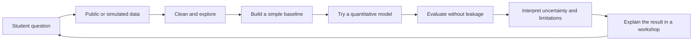
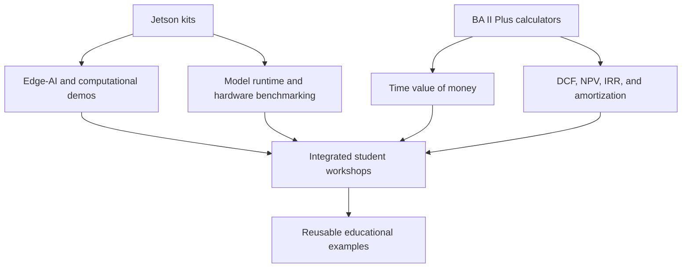
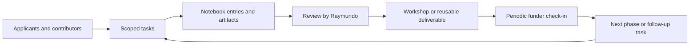

# Algorithmic Markets: Project Overview

## At a glance

| Field | Summary |
| --- | --- |
| Project | Algorithmic Markets: AI and Quantitative Decision Systems |
| Funding context | Principal Financial–funded student project |
| Planned period | September 23, 2026–April 2027 |
| Sole day-to-day project lead | Raymundo Munoz Cuevas |
| Funder check-in contact | Summer Malik; periodic progress updates only |
| Direct reach | Five accepted student contributors; workshop attendance reported separately |
| Core equipment | Two NVIDIA Jetson Orin Nano Super Developer Kits and six Texas Instruments BA II Plus calculators |
| Primary format | One five-student team; three guided sessions, one shared analysis, decision brief, and demonstration |

This page explains the project at a level that someone new to the repository can understand in a few minutes. The detailed operating rules live in the [lab notebook handbook](../Lab%20Notebooks/README.md).

## 1. The problem

Students often encounter finance, mathematics, statistics, artificial intelligence, and programming as separate subjects. That makes it difficult to see the complete chain from a real-world question to a data-informed decision:

```text
Question → Data → Model → Evaluation → Uncertainty → Decision
```

Traditional lecture-only exposure can explain individual formulas or algorithms without showing how they work together. Students also need a safe way to experiment with modern computational tools without confusing a classroom demonstration with a live financial product or investment recommendation.

The project addresses that gap by creating a reusable, interdisciplinary learning environment where students can build, inspect, test, and explain quantitative decision systems.

For the concrete real-world impact model, see the [Decision Lab impact plan](IMPACT.md).

## 2. What is being built

The team is building an educational platform, not a trading operation. Participants will use public or simulated data, financial calculators, software, and Jetson edge-AI hardware to explore:

- Financial reasoning: present value, time value of money, discounted cash flow, NPV, IRR, amortization, and risk-return tradeoffs.
- Data work: cleaning, visualization, exploratory analysis, feature construction, and data provenance.
- Modeling: predictive pipelines, machine learning concepts, time-series analysis, and baseline comparisons.
- Evaluation: train/test design, metrics, uncertainty, sensitivity analysis, failure modes, and model limitations.
- Communication: translating computational outputs into clear, cautious explanations for students from multiple academic backgrounds.

## 3. How the learning experience works



The loop is intentionally repeatable. Students should learn that the important result is not just a number produced by a model; it is the documented reasoning that explains where the number came from, how it was tested, and where it could fail.

## 4. Why the equipment matters

The equipment gives the project a physical, hands-on anchor:



The proposal’s planning baseline is $773.94:

| Resource | Quantity | Planning use |
| --- | ---: | --- |
| NVIDIA Jetson Orin Nano Super Developer Kit | 2 | Edge-AI, machine-learning, embedded-computing, and model-runtime demonstrations |
| Texas Instruments BA II Plus | 6 | Financial modeling exercises involving valuation, cash flows, NPV, IRR, and amortization |

Purchases, equipment setup, and condition are documented in the lab notebooks and managed by the project leads.

## 5. What participants will produce

| Output | What it should demonstrate |
| --- | --- |
| Workshop lesson | A clear learning objective, guided activity, expected result, and limitation statement |
| Quantitative example | A question, dataset or simulation, baseline, model, metric, and interpretation |
| Hardware demonstration | A repeatable setup, software environment, benchmark conditions, and observed performance |
| Valuation exercise | Explicit cash-flow assumptions, formulas, units, and sensitivity analysis |
| Progress record | Evidence of completed work, current status, blockers, and next actions |
| Reusable project material | Documentation that another approved contributor can run or teach later |

## 6. Boundaries

### Included

- Educational workshops and demonstrations.
- Public, synthetic, or explicitly approved datasets.
- Quantitative finance, AI, statistics, programming, and hardware experiments.
- Reproducible modeling and evaluation practices.
- Applications and onboarding for approved student contributors.
- Outreach that accurately describes the educational purpose of the project.

### Not included

- Live trading, brokerage activity, or real-money deployment.
- Investment advice or individualized financial recommendations.
- Guarantees of returns or claims that a classroom model predicts markets reliably.
- Private financial data, brokerage credentials, API keys, or other secrets.
- Production deployment or unapproved external integrations.

Every financial example must be presented as educational and research-oriented. The team must explain uncertainty and limitations wherever a participant could mistake a demonstration for a recommendation.

## 7. How progress is tracked



Raymundo leads the work and review the evidence. Summer periodically summarizes progress for the funder. The [lab notebook handbook](../Lab%20Notebooks/README.md) defines the required evidence and review standard.

## 8. Success measures

The project is progressing well when:

- Contributors can explain what they changed, why they changed it, and how they evaluated it.
- Workshops connect financial concepts to computational reasoning rather than presenting isolated formulas.
- Students can distinguish a model output from a validated conclusion.
- Hardware and educational materials are reusable across multiple events.
- Each major result has a clear baseline, data provenance, assumptions, limitations, and reviewer.
- All five contributors complete meaningful work; wider outreach is reported separately against the original 20–30-student planning target.

## Related documents

- [Roadmap and phase milestones](ROADMAP.md)
- [Workstreams and deliverables](WORKSTREAMS.md)
- [Lab notebook hygiene handbook](../Lab%20Notebooks/README.md)
- [Notebook entry template](../Lab%20Notebooks/TEMPLATE.md)
- [Contributor application template](../Lab%20Notebooks/APPLICATION_TEMPLATE.md)

## Alternate operating plan

See [team](TEAM.md), [tasks](TASKS.md), and [equipment](EQUIPMENT.md). Raymundo alone owns day-to-day leadership and final project approval. Student reviewers check evidence without becoming additional leads. The learning topics and materials above remain unchanged.
